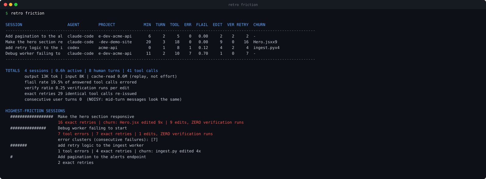
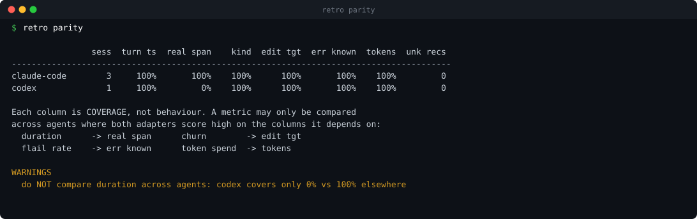
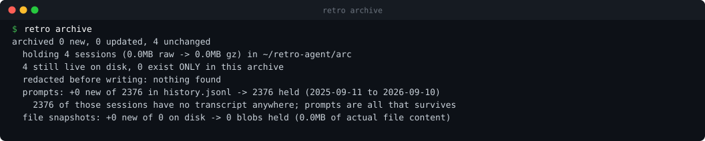
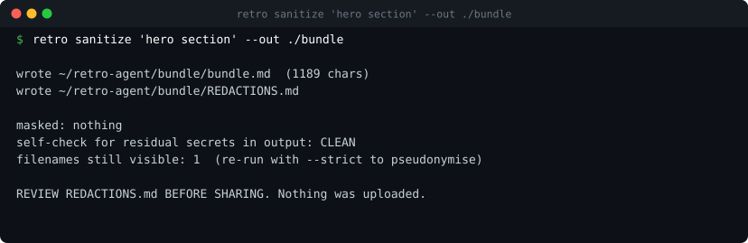
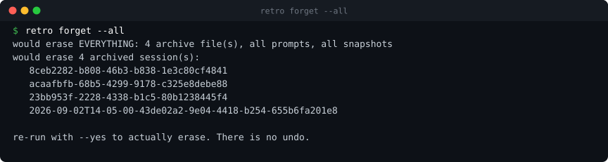

# retro

Local-only analytics over your coding-agent transcripts. Reads what Claude Code,
Codex and Cursor already write to disk, and answers questions their own dashboards
do not: **where did you have to say it twice**, and **can this session be shared
with anyone else**.

Nothing leaves your machine. No network calls, no API keys, no model required.

```bash
retro consent    # what gets stored, where, and why; required before archiving
retro archive    # checkpoint every session before the agent deletes it
retro scan       # parse archive + live sessions into SQLite
retro friction   # rework scorecard
retro parity     # what each adapter can and cannot see
retro sanitize   # redacted, shareable bundle of one session
retro status     # what is held, and what survives only here
retro encrypt    # encrypt the archive at rest (--decrypt to reverse)
retro forget     # erase sessions, prompts and snapshots. No undo.
```



## Why

Three separate problems, one parser.

**1. Your history is being deleted.** Claude Code removes session transcripts after
30 days by default (`cleanupPeriodDays`), silently and with no recovery path. If you
have never changed that setting, last month is already gone. `retro archive` snapshots
sessions before the window closes, and reports which ones now exist only in the archive.

**2. Token counts do not measure work.** A high-volume session is equally consistent
with productive work and with extensive rework. In one real corpus, cached-context
reads outnumbered generated tokens **296 to 1**, so anything ranking on "tokens used"
is ranking on context replay. retro computes rework directly from transcript structure
instead: file churn, verification ratio, repeated identical calls, error clusters.

**3. Transcripts cannot be shared.** Interviews increasingly ask for agent transcripts,
and nobody can hand one over. A single 26-session corpus contained 1,336 home-directory
paths, 360 email addresses, 68 IP addresses, plus API-key-shaped strings and database
connection URLs. Every existing redaction tool for these agents is *inbound* (stopping
secrets reaching the model). `retro sanitize` is outbound.

## Metrics

All deterministic. No LLM judges anything.

| metric | meaning |
|---|---|
| **verify ratio** | verification runs per file edit. The headline number. |
| **churn** | a file edited 3+ times inside a 10-call window with no verification between |
| **exact retries** | byte-identical tool calls re-issued |
| **flail rate** | share of answered tool calls that errored |
| **error clusters** | runs of consecutive failures |
| **active time** | wall time minus gaps over 5 minutes |

## Supported agents

| | store | retention | notes |
|---|---|---|---|
| Claude Code | `~/.claude/projects/**/*.jsonl` | ~30 days | named tools; richest error signal |
| Codex | `~/.codex/sessions/YYYY/MM/DD/rollout-*.jsonl` | long | shell-only tools; two format generations |
| Cursor | `state.vscdb` KV (`composerData:`, `bubbleId:`) | long | named tools; records accept/reject per edit |

Adapters normalise everything into one IR whose load-bearing field is `kind`
(`edit`/`read`/`shell`/`verify`/`search`/`web`/`other`), not the tool's name. Claude Code
names its tools; Codex routes nearly everything through `shell`. Metrics never see an
agent-specific string.



## Adapter parity: read this before comparing agents

Adapters have different blind spots, and **a coverage gap looks exactly like a
behavioural difference**. `retro parity` reports what each adapter can observe and
refuses to let you compare a metric whose inputs are not covered on both sides.

```
                sess  turn ts  real span    kind  edit tgt  err known  tokens
claude-code        8     100%       100%     75%       99%       100%    100%
codex              9     100%        44%     91%      100%       100%     44%
cursor           145      28%         9%     95%      100%       100%      0%

WARNINGS
  do NOT compare duration across agents: cursor covers only 9% vs 100% elsewhere
  do NOT compare token spend across agents: cursor covers only 0% vs 100% elsewhere
```

Run it before quoting any cross-agent number.

## Privacy model

**The archive is a permanent copy of data your agents would otherwise delete.** That
retention window was, incidentally, acting as a security control. The tool removes it,
so the following are on by default:

- **Consent is required.** `retro archive` will not run until you have read what gets
  stored and run `retro consent --accept`.
- **Credentials are redacted before they are written**, not after. API keys, connection
  strings, JWTs, private keys and `secret=`-style assignments are replaced in the JSONL
  as it is archived. Redaction is verified to keep each line valid JSON; a line that
  would be corrupted is kept raw and counted in the report.
- **Cursor source code is excluded.** Cursor stores full before/after file contents for
  every edit; those fields are replaced with `<CODE_OMITTED:Nb>` so the archive does not
  become a mirror of your codebase. Enable with `cursor_include_code` if you need diffs.
- **Encryption at rest** via `retro encrypt` (scrypt + Fernet). Set `RETRO_PASSPHRASE`
  for `scan`/`friction` to read it back. Lose the passphrase and the archive is gone.
- **Erasure**: `retro forget --session/--agent/--before/--pattern/--all`. Requires
  `--yes`. Removes archive files, blob files, prompt rows and derived metrics.
- Everything is local. No network calls anywhere in the codebase.
- `archive/` is `0700`, archived files `0600`, config and database `0600`.
- Cursor's store is opened **read-only** (`?mode=ro`) so a live editor is never at risk.
- `retro archive` takes a PID lock, so the `SessionEnd` hook cannot collide with a
  manual run.

### What is still on you

- The archive and database live **next to the code**, inside the checkout, and are
  gitignored. Exclude that directory from Time Machine, iCloud Drive and Dropbox. `0700`
  does not stop a backup agent, and unencrypted archives in cloud backups is the most
  likely way this leaks.
- The archive holds **third-party personal data**: other people's email addresses and
  the content of correspondence. For anything beyond personal use that carries legal
  obligations the tool does not help you meet.
- A sanitized bundle may still carry employer IP. Sharing one could breach an NDA.

## Gaps and limitations

Honest list. Several of these are load-bearing.

### Security and privacy

- **Email addresses are deliberately NOT redacted at archive time.** They are often
  load-bearing context, and redacting them would break the transcript's meaning. They
  are masked by `sanitize` on the way out instead. A single real corpus held 220
  distinct addresses across 104 external domains, so treat the archive accordingly.
- **Redaction is regex-based and will miss novel credential formats.** It reduces
  exposure; it does not eliminate it. There is no entropy-based fallback at archive time.
- **No automatic retention policy.** The archive grows without bound until you run
  `retro forget`. There is no age-based auto-expiry.
- **Encryption is opt-in and all-or-nothing.** Enabling it rewrites every archive file;
  there is no per-session encryption and no key rotation. Passphrase loss is terminal.
- **`forget` cannot reach copies that already left.** Backups, previously generated
  bundles, and anything you already shared are unaffected.

### Sanitizer

- **No semantic redaction pass.** Regex catches secrets, paths, emails and IPs. It does
  not catch *contextual* leaks that have no shape. A real example: a fully "clean" bundle
  still contained a job-board URL with posting IDs, revealing that the author was job
  hunting. Hostnames are visible by default (`--strict` masks them). A local-model pass
  is the intended fix and is not built.
- **File snapshot content is excluded entirely**, so bundles contain no before/after
  diffs. That is safe but removes the strongest evidence for a portfolio use case.
- **Filenames are visible by default.** `--strict` pseudonymises them.

### Metrics

- **`exact retries` overcounts.** Legitimately repeated idempotent commands
  (`git status`, re-reading a file) count as retries. Needs an idempotent-command
  whitelist.
- **`consecutive user turns` is noise** and is reported but deliberately not scored.
  Mid-turn messages are indistinguishable from correcting a drifting agent.
- **Edit detection for shell-driven agents is heuristic.** Codex edits are shell
  invocations, so detection relies on parsing `apply_patch`, `sed -i`, `tee` and
  redirects. Redirect targets must look like real files, which will miss some edits
  and may still catch some non-edits.
- **Verification detection is a regex over shell commands.** Verification performed
  through an IDE, a test runner UI, or a watcher is invisible. A low verify ratio may
  mean adapter blindness rather than user behaviour.

### Per-agent

- **Codex:** older sessions carry no per-record timestamps, so durations report `0`
  rather than being estimated. `custom_tool_call_output` has no exit code, so error
  detection there is text-heuristic and weaker than Claude Code's `is_error`.
  `patch_apply_end` can double count against shell `apply_patch` in mixed-format sessions.
- **Cursor:** no token counts at all (0% coverage). Most bubbles have no usable
  timestamp (9% of sessions span real time). The `userDecision` accept/reject field is
  captured but **not yet validated**: an observed 99.6% accept rate more likely reflects
  auto-apply behaviour than deliberate per-edit approval. Do not quote it as a quality
  metric. Cursor's KV schema is undocumented and shifts between versions.
- **Claude Code:** `kind` coverage is 75% because MCP tools are classified `other`.
- The archiver does not yet cover `tasks/`, `shell-snapshots/` or `backups/`, which the
  same cleanup also removes.

### Engineering

- No tests. None.
- The `install-hook` idempotency guard and `--uninstall` path are written but **untested**.
- Redaction adds a full decode/regex pass per line, so archiving is meaningfully slower
  than a straight copy.
- Format drift is guaranteed. Unrecognised record types are counted and reported rather
  than crashing, and that counter has already caught real bugs, but new record types are
  silently excluded from metrics until an adapter is updated.
- Single-user, single-machine. No sync, no team view.
- `scan` re-parses everything each run; there is no incremental mode.

## Install and run

Python 3.9+, standard library only. `cryptography` is needed only for `retro encrypt`.

```bash
git clone https://github.com/kushasahu7/retro-agent
cd retro-agent

./retro consent          # read what gets stored, then --accept
./retro consent --accept

./retro archive          # snapshot sessions before they are deleted
./retro scan             # parse into SQLite
./retro friction         # the scorecard
./retro parity           # adapter coverage; run before comparing agents
```

Add it to your PATH if you want `retro` from anywhere:

```bash
ln -s "$PWD/retro" /usr/local/bin/retro
```



### Share one session

```bash
./retro sanitize "hero section" --out ./bundle     # match on title or session id
./retro sanitize "hero section" --out ./bundle --strict   # also mask filenames and hosts
```

Writes `bundle/bundle.md` and `bundle/REDACTIONS.md`. **Read the redaction report before
sharing anything.**



### Automate it

```bash
./retro install-hook      # adds a SessionEnd hook to ~/.claude/settings.json
```

Backs up `settings.json` first and merges rather than overwriting. The archiver takes a
PID lock so the hook cannot collide with a manual run.

### Encrypt and erase

```bash
./retro encrypt                      # scrypt + Fernet; prompts for a passphrase
RETRO_PASSPHRASE=... ./retro scan    # read an encrypted archive back
./retro encrypt --decrypt

./retro forget --before 2026-01-01   # dry run
./retro forget --before 2026-01-01 --yes
./retro forget --all --yes           # everything
```



### Try it without touching your real data

The repo ships a synthetic corpus generator. This is also how the screenshots above are
produced, so no real session data ever enters the repository.

```bash
python3 tools/demo_corpus.py /tmp/retro-demo
export RETRO_PROJECTS=/tmp/retro-demo/projects \
       RETRO_CODEX=/tmp/retro-demo/codex/sessions \
       RETRO_ARCHIVE=/tmp/retro-demo/arc \
       RETRO_DB=/tmp/retro-demo/demo.db \
       RETRO_CLAUDE=/tmp/retro-demo/claude \
       RETRO_CURSOR_DB=/tmp/retro-demo/none.vscdb
./retro consent --accept && ./retro archive && ./retro scan && ./retro friction
```

Every store path is env-overridable (`RETRO_PROJECTS`, `RETRO_CODEX`, `RETRO_CURSOR_DB`,
`RETRO_ARCHIVE`, `RETRO_DB`, `RETRO_CLAUDE`), so you can point retro at a copy of your
data rather than the live one.

Regenerate the screenshots with:

```bash
python3 tools/screenshot.py /tmp/retro-demo
```

## Status

Working prototype, built and validated against a real 162-session corpus across three
agents. Not packaged, not tested, not hardened. Read Gaps before trusting a number.

## License

MIT
